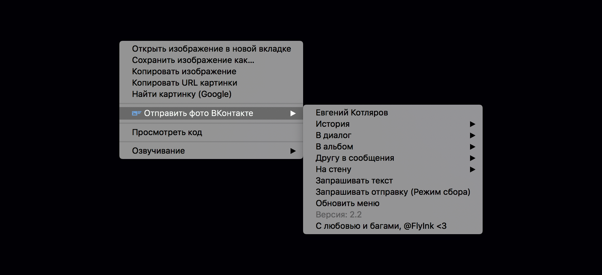

# [Отправить фото ВКонтакте](https://chrome.google.com/webstore/detail/kbafjbahbohbfeifjpgomdlkcjcmdgfi)

Google Chrome расширение для отправки фото из контекстного меню

## Обновления
### 2.3
- Найти здесь изображение (Поиск скрытых изображений)
- Исправил очистку данных

### 2.2
- Обновил версию API: 5.103
- Обновил execute: getDialogs заменил на getConversations
- Обновили генерацию меню: createContextMenu
- Добавил заглушку для пустых пунктов меню
- Исправил ссылку на профиль
- Исправил дублирование меню при ошибке
- Исправил ошибку при пустых списках в меню
- Исправил иконки в manifest.json
- Исправил режим сбора фото 
- Добавил ссылку на [группу разработчика](https://vk.com/flyink)

### 2.1
- Исправлен баг, который ломал отправку, если в истории более 10 элементов

### 2.0:
- Исправлена загрузка файлов
- Исправлена загрузка на свою стену
- Рефакторинг
- Ускорено обновление меню
- Добавили очистку истории
